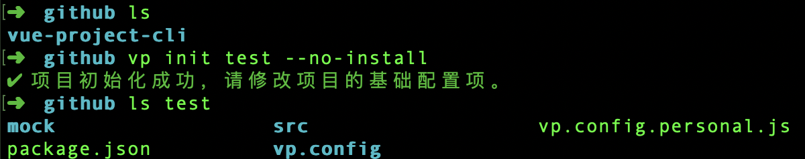
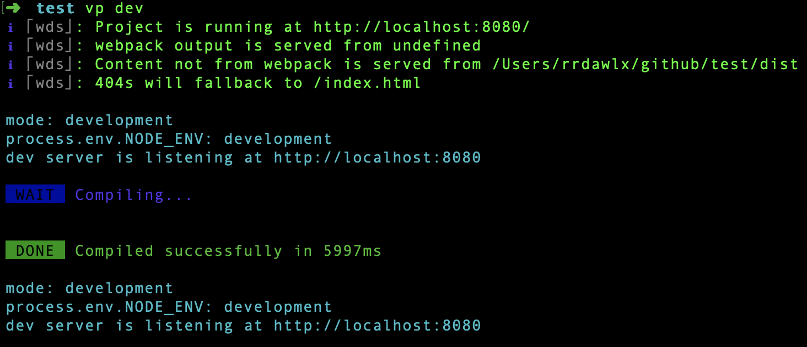
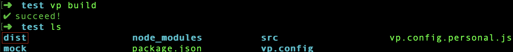
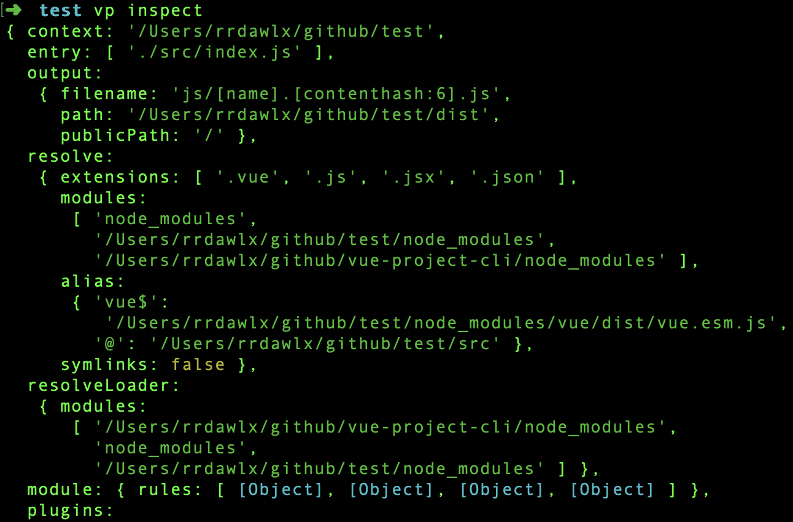
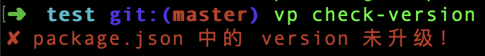
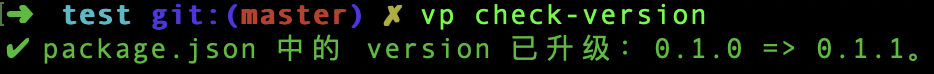
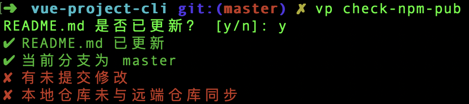
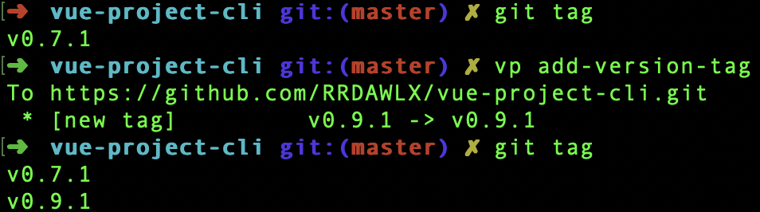
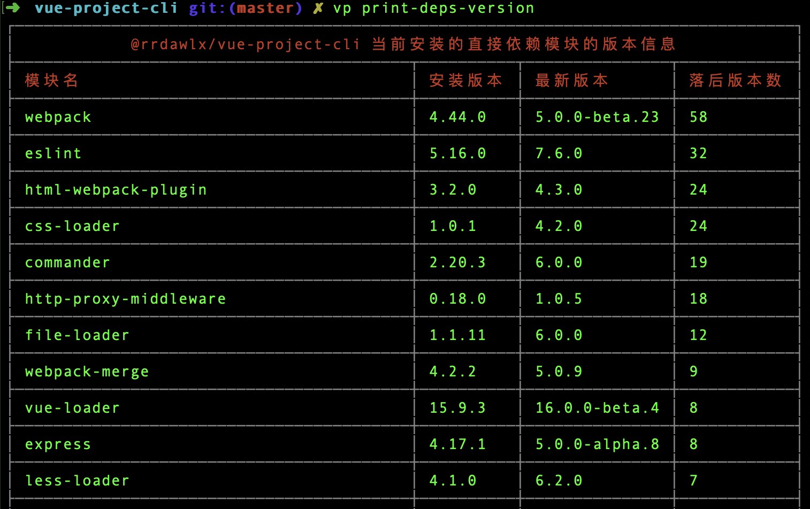

# vue-project-cli
vue project command line tool

# 使用
```
Usage: vp [options] [command]

Options:
  -v, --version       output the version number
  -h, --help          output usage information

Commands:
  init [directory]    新建项目，如未提供目录名 directory，则以当前目录为根目录新建项目。
  dev                 项目开发
  build               项目构建
  inspect             查看项目配置
  check-version       校验项目中 package.json 的 version 字段是否已升级
  check-npm-pub       执行 npm publish 前的检查工作
  add-version-tag     给项目仓库打上基于当前 commit 中的 package.json 中 version 的 tag
  print-deps-version  输出项目依赖的版本信息
  help [cmd]          display help for [cmd]
```
```
Usage: vp-init [options] [directory]

Options:
  --no-install  不执行 npm install 命令
  -h, --help    output usage information
```
```
Usage: vp-dev [options]

Options:
  --mode <mode>     项目模式，根据此值选择 webpack 配置，可选项：development、production。 (default: "development")
  --node-env <env>  设置 process.env.NODE_ENV 的值，默认与 mode 为相同值。
  -h, --help        output usage information
```
```
Usage: vp-build [options]

Options:
  --mode <mode>     项目模式，根据此值选择 webpack 配置，可选项：development、production。 (default: "production")
  --node-env <env>  设置 process.env.NODE_ENV 的值，默认与 mode 为相同值。
  -h, --help        output usage information
```
```
Usage: vp-inspect [options]

Options:
  --mode <mode>     项目模式，根据此值选择 webpack 配置，可选项：development、production。 (default: "production")
  --node-env <env>  设置 process.env.NODE_ENV 的值，默认与 mode 为相同值。
  -h, --help        output usage information
```

# 示例
vp-init  


vp-dev  


vp-build  


vp-inspect  


vp-check-version  



vp-check-npm-pub  


vp-add-version-tag  


vp-print-deps-version  


# 开发
1. 在项目根目录执行 [```npm link```](https://docs.npmjs.com/cli-commands/link.html) 以在全局注册 vp 命令；
2. 执行 ```vp -v``` 测试 vp 命令是否可用。